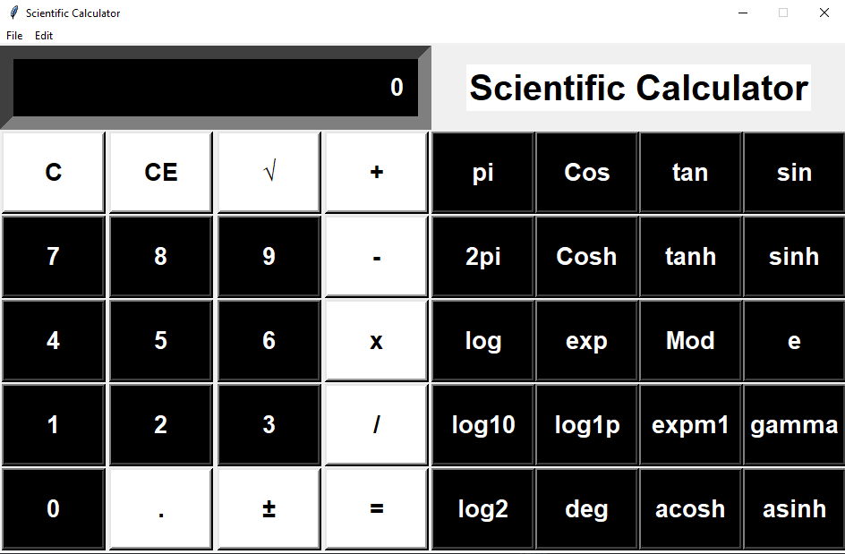
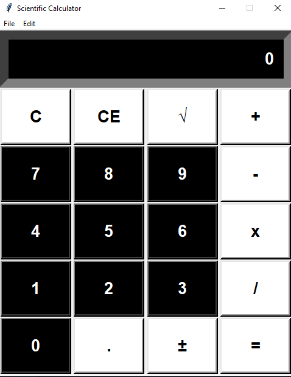

# Scientific Calculator with Python

## Description

GUI Scientific Calculator using Python. To implement GUI the Tkinter module was used.
The calculator have 2 modes. 'Standard' and 'Scientific'.

